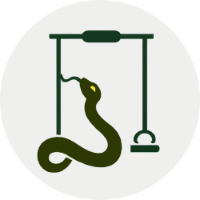

# There's a snake in my boot! 🐍🍓



Snakewing is a simple snake game implementation that experiments with singletons, building up to a very rudimentary engine/framework. It includes an implementation of a modern app routing system to navigate the UI outisde of the game as well as theme/style state management with data permanence.

## Installation 🔶

- Clone the repository:

  ```shell
  git clone https://github.com/dy0gu/Snakewing.git
  ```

- Install the JDK 17 or newer.
- Compile the source code:

  ```shell
    javac -d bin src/*.java
    jar cfe bin/Snakewing.jar Main -C bin .
  ```

## Usage 🔷

- Launch the game:

  ```shell
  java -jar bin/Snakewing.jar
  ```
