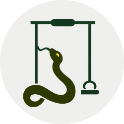

# There is a snake in my boot! 🐍🔴



////

## Installation 🛠️

* Clone the repository

  ```shell
  git clone https://github.com/Diogu-Simoes/Snakeswing.git
  ```

* Compile the source code:

  ```shell
    javac -d bin src/*.java
    jar cfe bin/Snakeswing.jar Main -C bin .
  ```

## Usage 🚩

* Launch the game:

  ```shell
  ./thinkit
  ```
